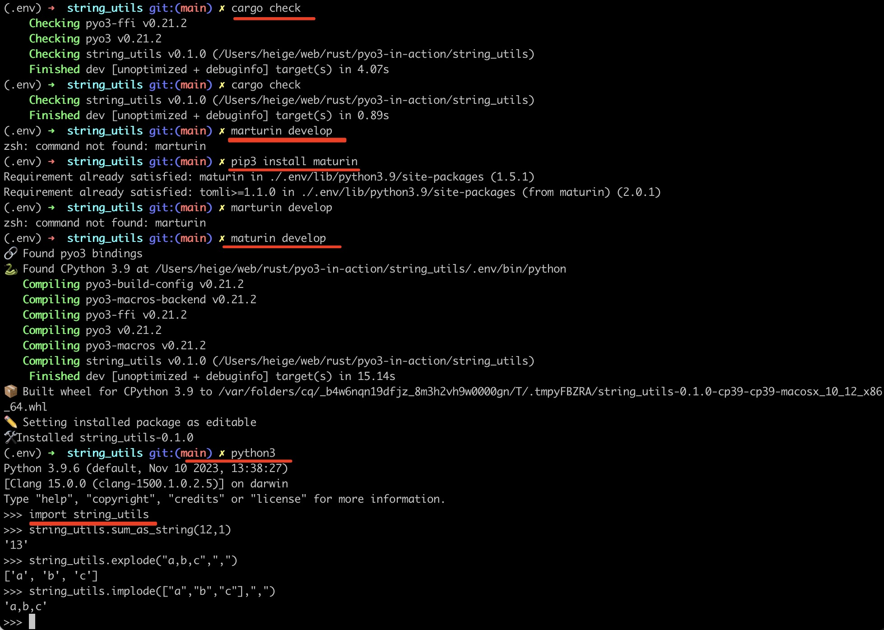

# pyo3-in-action

rust pyo3 for python extension-module

# pyo3为python编写拓展

版本约定：

- python 3.7+
- rust 1.56+

# cargo new创建library

```shell
cd ~
cargo new --lib string_utils
```

# 添加pyo3依赖

在Cargo.toml文件中添加如下内容：

```toml
[lib]
# The name of the native library. This is the name which will be used in Python to import the
# library (i.e. `import string_utils`). If you change this, you must also change the name of the
# `#[pymodule]` in `src/lib.rs`.
name = "string_sum"

# "cdylib" is necessary to produce a shared library for Python to import from.
#
# Downstream Rust code (including code in `bin/`, `examples/`, and `tests/`) will not be able
# to `use string_utils;` unless the "rlib" or "lib" crate type is also included, e.g.:
# crate-type = ["cdylib", "rlib"]
crate-type = ["cdylib"]

# See more keys and their definitions at https://doc.rust-lang.org/cargo/reference/manifest.html

[dependencies]
pyo3 = { version = "0.21.2", features = ["extension-module"] }
```

# lib.rs代码

```rust
// 引入pyo3包
use pyo3::prelude::*;

#[pyfunction]
fn sum_as_string(a: usize, b: usize) -> PyResult<String> {
    Ok((a + b).to_string())
}

#[pyfunction]
fn explode<'a>(s: &'a str, sep: &'a str) -> Vec<&'a str> {
    let v = s.split(sep).collect();
    v
}

#[pyfunction]
fn implode(v: Vec<String>, sep: &str) -> String {
    let s = v.join(sep);
    s
}

// 将函数注册到模块string_utils中
#[pymodule]
fn string_utils(m: &Bound<'_, PyModule>) -> PyResult<()> {
    m.add_function(wrap_pyfunction!(sum_as_string, m)?)?;
    m.add_function(wrap_pyfunction!(explode, m)?)?;
    m.add_function(wrap_pyfunction!(implode, m)?)?;
    Ok(())
}
```

# 安装maturin工具

maturin主要作用：使用pyo3, rust-cpython或cffi绑定以及rust二进制文件作为python包构建和发布crate

```shell
cd string_utils
# 创建一个python虚拟环境
python3 -m venv .env
source .env/bin/activate
# .env/bin/python3 -m pip install --upgrade pip
pip3 install maturin
```

- 如果你是通过cargo new --lib string_sum方式创建的lib，就不需要执行上面的 maturin init操作。
- 如果你是在一个目录中执行python虚拟机环境创建并激活后，那你可以 maturin 创建一个rust library库，操作如下：
    ```shell
    maturin init --bindings pyo3
    ```
  运行上面的命令后，就会在string_sum初始化一个rust lib项目，这个命令相当于 cargo init

# 下载相关依赖并构建模块string_utils

```shell
# 当lib.rs代码发生改变，就需要重新运行这个命令构建和变异
maturin develop
```

# 进入python3终端运行

```shell
(.env) ➜ python3
Python 3.9.6 (default, Nov 10 2023, 13:38:27)
[Clang 15.0.0 (clang-1500.1.0.2.5)] on darwin
Type "help", "copyright", "credits" or "license" for more information.
>>> import string_utils
>>> string_utils.sum_as_string(12,1)
'13'
>>> string_utils.explode("a,b,c",",")
['a', 'b', 'c']
>>> string_utils.implode(["a","b","c"],",")
'a,b,c'
>>>
```

到这里，恭喜你，pyo3编写python拓展完毕！

上面的demo运行效果如下图所示：

