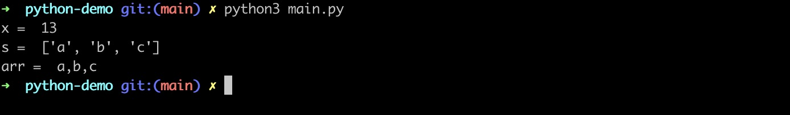

# pyo3-in-action

rust pyo3 for python extension-module

# pyo3包

- pyo3作为一个组件库，可用于生成本机Python模块，它不仅可以使用rust编写python模块，同时它提供了rust和python互操作，也就是说rust中也可以调用python的相关模块。
- pyo3库依赖于Python的C扩展机制，因此在使用之前需要确保你的系统已经安装了适当的编译器和依赖项。此外，pyo3目前仅支持Linux和macOS操作系统。对于Windows用户，可以使用Cygwin或Windows
  Subsystem for Linux (WSL)来运行pyo3。
- 另外，如果你要在生产环境中使用Python与Rust的集成，还需要考虑性能、错误处理和安全性等方面的问题。
- pyo3库提供了一种简单的方式来在Python中调用Rust代码，使得Python和Rust之间的集成更加方便。

官网文档：

- https://crates.io/crates/pyo3
- https://github.com/pyo3/pyo3

# pyo3为python编写拓展

版本约定：

- python 3.7+
- rust 1.56+

# cargo new创建library

```shell
cd ~
cargo new --lib string_utils
```

# 添加pyo3依赖

在Cargo.toml文件中添加如下内容：

```toml
[lib]
# The name of the native library. This is the name which will be used in Python to import the
# library (i.e. `import string_utils`). If you change this, you must also change the name of the
# `#[pymodule]` in `src/lib.rs`.
name = "string_sum"

# "cdylib" is necessary to produce a shared library for Python to import from.
#
# Downstream Rust code (including code in `bin/`, `examples/`, and `tests/`) will not be able
# to `use string_utils;` unless the "rlib" or "lib" crate type is also included, e.g.:
# crate-type = ["cdylib", "rlib"]
crate-type = ["cdylib"]

# See more keys and their definitions at https://doc.rust-lang.org/cargo/reference/manifest.html

[dependencies]
pyo3 = { version = "0.21.2", features = ["extension-module"] }
```

# lib.rs代码

```rust
// 引入pyo3包
use pyo3::prelude::*;

#[pyfunction]
fn sum_as_string(a: usize, b: usize) -> PyResult<String> {
    Ok((a + b).to_string())
}

#[pyfunction]
fn explode<'a>(s: &'a str, sep: &'a str) -> Vec<&'a str> {
    let v = s.split(sep).collect();
    v
}

#[pyfunction]
fn implode(v: Vec<String>, sep: &str) -> String {
    let s = v.join(sep);
    s
}

// 将函数注册到模块string_utils中
#[pymodule]
fn string_utils(m: &Bound<'_, PyModule>) -> PyResult<()> {
    m.add_function(wrap_pyfunction!(sum_as_string, m)?)?;
    m.add_function(wrap_pyfunction!(explode, m)?)?;
    m.add_function(wrap_pyfunction!(implode, m)?)?;
    Ok(())
}
```

# 安装maturin工具

maturin主要作用：使用pyo3, rust-cpython或cffi绑定以及rust二进制文件作为python包构建和发布crate

首先，执行下面的命令创建一个包含新的Python virtualenv的新目录，并使用Python的包管理器pip将maturin安装到虚拟环境中。

```shell
cd string_utils
# 创建一个python虚拟环境
python3 -m venv .env
source .env/bin/activate
# .env/bin/python3 -m pip install --upgrade pip
pip3 install maturin
```

- 如果你是通过cargo new --lib string_utils方式创建的library，就不需要执行maturin init操作。
- 如果你是在一个目录中执行python虚拟机环境创建并激活后，那你可以 maturin 创建一个rust library库，操作如下：
    ```shell
    maturin init --bindings pyo3
    ```
  运行上面的命令后，就会在string_sum初始化一个rust lib项目，这个命令相当于 cargo init

# 下载相关依赖并构建模块string_utils

```shell
# 当lib.rs代码发生改变，就需要重新运行这个命令构建和变异
maturin develop
```

这个命令会把rust pyo3编写的python模块编译为共享库xxx.so文件（不同平台生成的so文件名字不一样），放在.env/lib/python3.9/site-packages/string_utils目录下面。

```shell
➜  cd .env/lib/python3.9/site-packages/string_utils
➜  ls
__init__.py                       string_utils.cpython-39-darwin.so
```

这个string_utils 是可以复制到你的python其他项目中作为独立的模块使用。

# 进入python3终端运行

```shell
(.env) ➜ python3
Python 3.9.6 (default, Nov 10 2023, 13:38:27)
[Clang 15.0.0 (clang-1500.1.0.2.5)] on darwin
Type "help", "copyright", "credits" or "license" for more information.
>>> import string_utils
>>> string_utils.sum_as_string(12,1)
'13'
>>> string_utils.explode("a,b,c",",")
['a', 'b', 'c']
>>> string_utils.implode(["a","b","c"],",")
'a,b,c'
>>>
```

到这里，恭喜你，pyo3编写python拓展完毕！

上面的demo运行效果如下图所示：


# python文件中引入string_utils模块

- 当我们完成上面的pyo3编写的string_utils模块后，在.env/lib/python3.9/site-packages/目录下面有一个`string_utils`
  模块，它是可以被复制到python项目中使用的。
- 为了验证这一点，我们新建一个python-demo项目把.env/lib/python3.9/site-packages/string_utils复制到python-demo目录，然后添加一个main.py文件，并添加如下代码：

```python
import string_utils;

x = string_utils.sum_as_string(12, 1);
print("x = ", x);

s = string_utils.explode("a,b,c", ",")
print("s = ", s);

arr = s = string_utils.implode(['a', 'b', 'c'], ",")
print("arr = ", arr);
```

运行python3 main.py，效果如下图所示：


# rust容器环境搭建

直接运行如下命令，就可以构建一个本地的rust docker运行环境（包含python3 pip3工具）

```shell
sh bin/docker-rs.sh
```

效果如下图所示：


# 如何rust中调用python模块

直接看rs-python-demo即可
