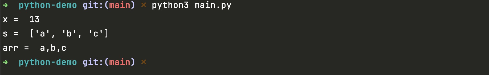

# python使用rust pyo3编写的模块

1. 运行之前，请先执行string_utils的rust构建和 maturin develop 操作，具体步骤：
   https://github.com/daheige/pyo3-in-action/blob/main/README.md
2. 当你运行好了string_utils后，在string_utils/.env/lib/python3.9/site-packages/就会有string_utils目录，你需要将xxx.so文件复制到该string_utils下面。
3. 执行`python3 main.py`命令,运行效果如下图所示：
   
