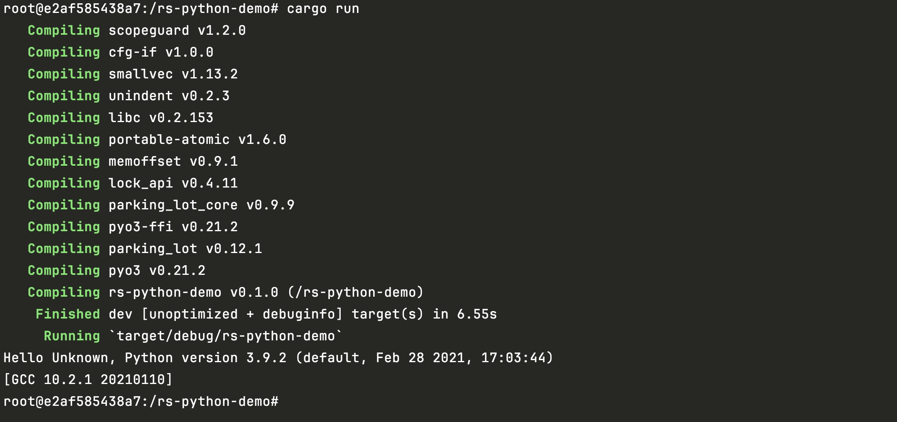

# 在rust中使用python的模块

要将Python嵌入到Rust二进制文件中，需要确保Python安装包含一个共享库。
假设我们用的ubuntu操作系统，先需要安装好python3环境和pip3，安装方式如下：

```shell
sudo apt install python3-dev python3-pip
python3 -m pip install --upgrade pip
```

当安装好python3后，就可以通过 `cargo new rs-python-demo` 命令创建一个rust二进制应用，并在Cargo.toml中添加如下依赖：

```toml
[dependencies]
pyo3 = { version = "0.21.2", features = ["auto-initialize"] }
```

接着在main.rs中添加如下代码：

```rust
use pyo3::prelude::*;
use pyo3::types::IntoPyDict;

fn main() -> PyResult<()> {
    Python::with_gil(|py| {
        let sys = py.import_bound("sys")?; // 导入python sys包
        let version: String = sys.getattr("version")?.extract()?; // 调用sys.version命令获取python版本

        let locals = [("os", py.import_bound("os")?)].into_py_dict_bound(py); // 导入os模块
        let code = "os.getenv('USER') or os.getenv('USERNAME') or 'Unknown'";
        let user: String = py.eval_bound(code, None, Some(&locals))?.extract()?;

        println!("Hello {}, Python version {}", user, version);
        Ok(())
    })
}
```

当运行cargo run就会看到对应的提示，如下图所示：

